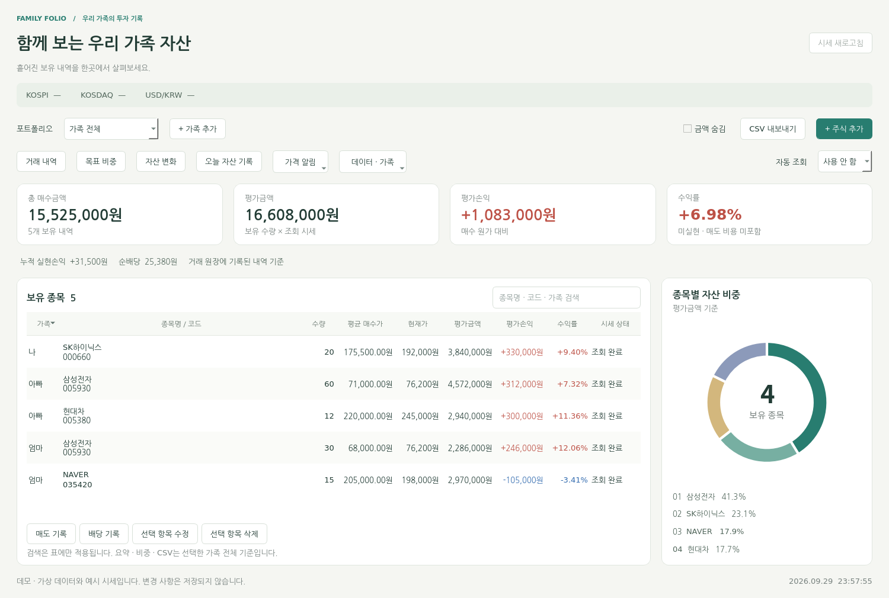
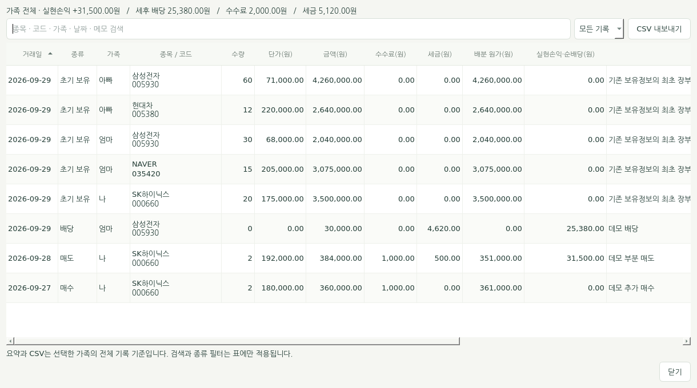
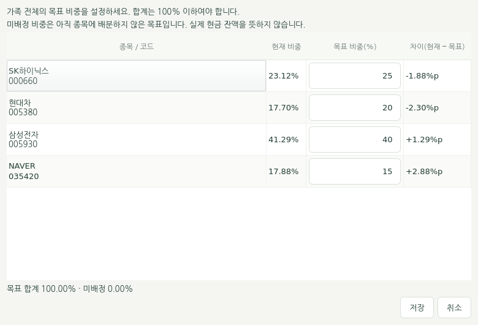
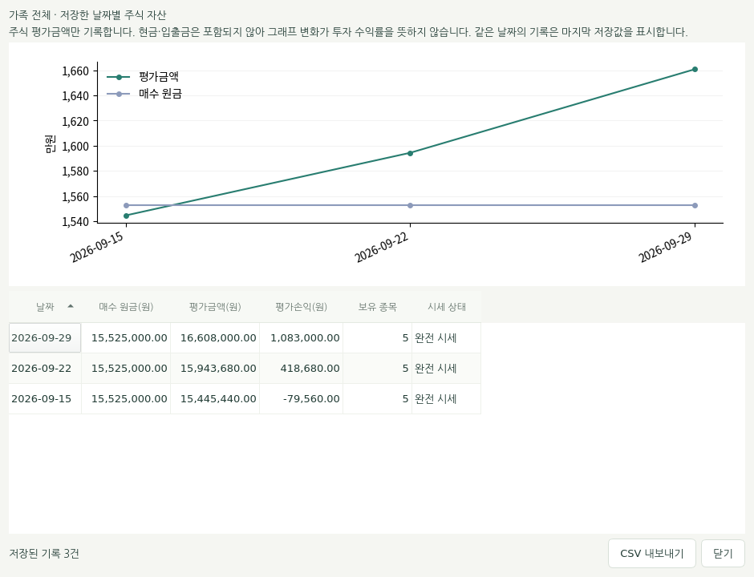

# 가족 주식 포트폴리오 관리기 · Family Folio

가족 구성원별 **보유 주식, 매수·매도·배당, 목표 비중, 자산 변화**를 관리하는 Python / PyQt5 데스크톱 앱입니다.
가족에게 보유 수량과 평단가를 반복해서 물어보던 불편에서 시작한 프로젝트를 함께 사용하는 투자 기록 도구로 확장했습니다.



> 모든 예시 화면은 가상 데이터입니다. 실제 시세나 가족의 실제 보유 내역이 아닙니다.

## 실행

Python 3.12 이상을 권장합니다.

```bash
python -m venv .venv
# Windows PowerShell: 아래 명령으로 활성화
.venv\Scripts\Activate.ps1
# macOS / Linux: 위 Windows 명령 대신 아래 명령 사용
source .venv/bin/activate

python -m pip install -r requirements.txt
python main.py
```

```bash
python main.py --demo                     # 실제 파일·네트워크 없는 체험
python main.py --data ./my_portfolio.json # 별도 데이터 파일
python first.py                          # 터미널 메뉴
```

데모에는 가상의 거래, 목표 비중, 자산 변화 기록이 들어 있습니다. 데모의 변경은 종료하면 사라집니다. CSV와 JSON 백업은 직접 지정한 경로에 내보낼 수 있습니다.

Linux에서는 Qt 실행용 그래픽 라이브러리와 한글 폰트가 필요할 수 있습니다. Ubuntu 예시:

```bash
sudo apt-get install libegl1 libgl1 fonts-noto-cjk
```

## 주요 기능

| 기능 | 동작 |
| --- | --- |
| 가족별·전체 대시보드 | 매수원가, 평가액, 미실현손익, 수익률, 누적 실현손익, 순배당 |
| 가족 관리 | 구성원 추가·이름 변경, 보유·거래 기록이 없는 가족 삭제 |
| 보유 관리 | 추가 매수, 입력 오류 정정, 제거 이력 보관, 같은 코드 합산 |
| 매도 기록 | 부분·전량 매도, 평균원가 배분, 수수료·세금 반영 |
| 배당 기록 | 세전 배당과 원천징수, 순배당 합산, 전량 매도한 종목도 기록 가능 |
| 거래 원장 | 기초 잔고·매수·매도·배당·정정·제거 기록, 검색·종류 필터·CSV |
| 목표 비중 | 전체/가족별 목표 설정, 현재 비중과 차이를 %p로 비교 |
| 자산 변화 | 날짜별 주식 평가액 기록, 원가·평가액 그래프, CSV |
| 가격 알림 | 지정 가격 이상/이하 도달 시 앱 내 배너·소리 |
| 시세 갱신 | 수동 또는 1·5·15분 간격, UI 중단 없이 최대 4개 동시 요청 |
| 데이터 보관 | 원자적 저장, 이전 버전 `.bak`, 전체 JSON 백업·가져오기 |
| 편의 기능 | 검색, 숫자 정렬, 자산 비중 차트, 금액 숨김, 단축키 |

검색은 표에만 적용합니다. 대시보드 요약·비중·CSV는 선택한 가족의 전체 보유 내역 기준입니다. 거래 창의 검색·종류 필터도 표에만 적용하며, 거래 CSV에는 선택한 가족의 모든 기록이 들어갑니다.

### 거래 기록



1. **주식 추가**: 종목·수량·단가·매수 수수료·거래일·메모를 입력합니다. 같은 코드가 있으면 합산합니다.
2. **매도 기록**: 표에서 종목을 선택하고 매도 수량·단가·비용을 입력합니다. 확인 전에 예상 실현손익을 보여줍니다. 실제 주문은 제출하지 않습니다.
3. **배당 기록**: 보유 종목을 선택합니다. 전량 매도 후 받은 배당은 표 선택을 해제하고 버튼을 눌러 과거 거래 종목을 선택할 수 있습니다.
4. **정보 수정/삭제**: 거래와 구분되는 정정·제거 이력을 남깁니다. 제거는 매도가 아니며 실현손익을 만들지 않습니다.

- 매수 수수료는 보유 원가에 포함합니다.
- 매도 실현손익 = 매도대금 − 매도 수수료 − 세금 − 평균원가로 배분한 매수원금.
- 순배당 = 세전 배당 − 배당 세금. 매도 실현손익과 구분하여 표시합니다.
- 정확한 총 원가를 Decimal 소수 문자열로 보존합니다. 부분 매도 후 남은 원가를 유지하고 마지막 매도가 잔여 원가를 모두 사용합니다.
- 기존 파일의 보유분은 처음 거래 기능을 사용할 때 `초기 보유`로 등록됩니다. 해당 날짜는 이관일이며 과거 매수일을 추정한 값이 아닙니다.
- 초기 보유를 제외한 같은 가족·종목의 거래는 날짜순으로 추가합니다. 같은 날짜는 입력 순서를 사용하며, 미래 날짜와 기존 거래보다 과거인 날짜는 거부합니다.
- 과거 거래의 수정/삭제와 전체 원장의 소급 재계산은 지원하지 않습니다. 잘못 입력한 직후에는 이전 `.bak`을 가져와 복구할 수 있습니다. 이후 거래가 있다면 복구할 범위를 먼저 확인하세요.

### 목표 비중과 자산 기록



`목표 비중`에서 종목별 비율을 입력합니다. 합계는 100% 이하여야 합니다. 0%는 목표에서 제거하며, 미배정 비중은 실제 현금 잔액이 아닙니다. 시세가 하나라도 미확인·이전 값이면 비교 비중과 차이를 확정값으로 표시하지 않습니다.



`오늘 자산 기록`은 선택한 가족의 현재 주식 평가액을 저장합니다. 모든 보유 종목의 시세 조회가 성공해야 하며, 같은 날짜·가족의 기록은 최신 값으로 갱신합니다. **현금·입출금은 포함하지 않으므로 그래프의 증감이 투자 수익률을 뜻하지 않습니다.** 과거 시세를 자동으로 수집하는 기능은 아닙니다.

### 알림과 단축키

가격 알림은 앱이 실행 중이고 시세가 조회될 때만 확인합니다. 이전 시세나 미확인 값으로는 울리지 않습니다. 같은 조건이 유지되면 소리를 반복하지 않으며, 조건 해제 후 다시 도달하면 알립니다. 메신저·이메일·모바일 푸시를 발송하지 않습니다.

| 단축키 | 기능 |
| --- | --- |
| Ctrl+R | 시세 새로고침 |
| Ctrl+F | 종목 검색 |
| Ctrl+N | 매수 기록 추가 |
| Ctrl+E | 보유 CSV 내보내기 |
| Ctrl+T | 거래 원장 열기 |

금액 숨김은 **대시보드의 금액·수량만** 가립니다. 별도 다이얼로그와 CSV/JSON에는 원래 값이 포함됩니다. 자동 조회 간격과 숨김 상태는 이번 실행 세션에 적용됩니다.

## 시세와 계산 범위

국내 6자리 종목코드와 원화 금액을 지원합니다. [네이버 종목 응답](https://polling.finance.naver.com/api/realtime/domestic/stock/005930), [시장 지수](https://polling.finance.naver.com/api/realtime/domestic/index/KOSPI,KOSDAQ), [환율](https://api.stock.naver.com/marketindex/exchange/FX_USDKRW)을 사용합니다. 장기 호환이 보장된 계약 API는 아니므로 공급자 변경에 따라 조회가 실패할 수 있습니다.

조회 실패 시 같은 실행 세션의 이전 성공값을 유지하고 `이전 시세`로 표시합니다. 한 번도 조회하지 못한 종목은 평가액·미실현손익·수익률·차트에서 제외합니다. 총 매수원가는 유지하고 일부 합계임을 표시합니다. 모든 가격이 미확인이면 평가 지표는 `—`입니다.

미실현 수익률은 **조회된 종목의 평가손익 ÷ 같은 종목들의 보유 원가**입니다. 예상 매도 수수료·세금은 반영하지 않습니다. 시세 상태에 마우스를 올리면 앱의 성공 조회 시각과 전일 대비를 볼 수 있습니다. 이 시각은 거래소 체결 시각과 다릅니다.

연결/읽기 타임아웃은 3초/5초이며 재시도하지 않습니다. DNS 등 전체 소요 시간의 엄밀한 상한은 아닙니다. 조회 중 종료 시 진행 중인 요청을 정리한 뒤 창을 닫습니다.

## 데이터 형식과 복구

기본 파일은 프로그램과 같은 폴더의 `family_stocks.json`입니다. 실행한 작업 폴더와 무관합니다. `--data` 또는 `FAMILY_STOCK_DATA_FILE` 환경 변수로 바꿀 수 있습니다. 파일이 없으면 빈 가족 목록으로 시작합니다.

기존 `가족 이름 → 종목 배열` JSON을 그대로 읽습니다. 거래·목표·기록·알림을 사용하면 다음의 버전 2 형식으로 저장합니다.

```json
{
  "schema_version": 2,
  "members": {"나": []},
  "metadata": {
    "transactions": [], "ledger_initialized": false,
    "targets": {}, "snapshots": [], "alerts": []
  }
}
```

저장할 기존 파일이 있으면 바로 이전 정상 내용이 `<파일명>.bak`에 남습니다. 백업은 한 세대이며 거래와 설정도 포함합니다. `데이터 · 가족 → 전체 JSON 백업`으로 별도 백업을 만들 수 있습니다. `JSON 가져오기 / 복구`는 내용을 검증한 뒤 확인을 거쳐 현재 전체 데이터를 교체합니다. 손상 파일이나 알 수 없는 버전은 초기화하거나 덮어쓰지 않습니다.

외부 프로그램이 파일을 변경했으면 저장을 중단합니다. 완전한 다중 프로세스 잠금은 아니므로 한 파일에는 한 앱을 사용하세요. 개별 수량은 20억 주, 단가는 1조 원까지 검증합니다.

실제 보유 파일은 Git 추적에서 제외하고 빈 `family_stocks.example.json`만 제공합니다. 이전 커밋의 Git 이력은 다시 쓰지 않았습니다.

## 개발 및 검증

```bash
# Linux / macOS
QT_QPA_PLATFORM=offscreen python -m unittest discover -s tests -v

# Windows PowerShell
$env:QT_QPA_PLATFORM = 'offscreen'
python -m unittest discover -s tests -v
```

테스트는 임시 파일과 가짜 시세를 사용합니다. 계산·이관·원장·목표·알림·백업·GUI·작업자 동작을 검증합니다. GitHub Actions는 Python 3.12와 3.13에서 실행합니다.

```text
main.py / first.py    # 데스크톱 / 터미널 진입점
feature_ui.py         # 거래·목표·알림·자산 기록 다이얼로그
portfolio.py          # 정확한 보유 평가와 CSV
trading.py            # 매수·매도·배당·정정 원장
analytics.py          # 목표 비중·자산 기록·가격 알림·가족 관리
data_manager.py      # 구형/버전2 파일 검증·원자적 저장·백업
scraper.py           # 네이버 시세 공급자
tests/               # 외부 네트워크 없는 회귀 테스트
```

설계 배경과 구현 과정은 [CHANGELOG.md](CHANGELOG.md), 재사용할 개발 프롬프트는 [UPGRADE_PROMPT.md](UPGRADE_PROMPT.md)에 있습니다.
